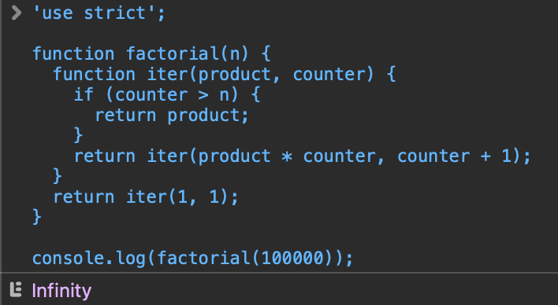

> 1. プログラミング言語や処理系によっては、再帰呼び出しを関数の処理の末尾にする(末尾再帰)ことで、スタックオーバーフローが起こらないよう最適化できるものがある。末尾再帰は何故そのような最適化ができるのか答えなさい。

通常再帰呼び出しした場合、スタックには呼び出し元のスタックフレームの上に呼び出し先のスタックフレームがプッシュされるため、再帰呼び出しした回数分スタックフレームがプッシュされ、ある回数を境にスタックオーバーフローとなる。しかし、末尾再帰の場合、呼び出し先の計算結果が呼び出し元の結果になるため、呼び出し先と呼び出し元でスタックフレームを別にする必要がない。したがって、呼び出し元のスタックフレームを呼び出し先のスタックフレームとして使用する最適化が可能となる。

> 2. JavaScript で末尾再帰最適化を実装している処理系を答えなさい。  
利用できる環境があれば、実際に以下の URL を表示・実行してエラーが発生しないことを確認しなさい。 

[ECMAScript6 Capability Table](https://compat-table.github.io/compat-table/es6/)によると、proper tail calls (tail call optimisation)を対応済のブラウザはSafari。Safariで実行した結果は下記となる。
