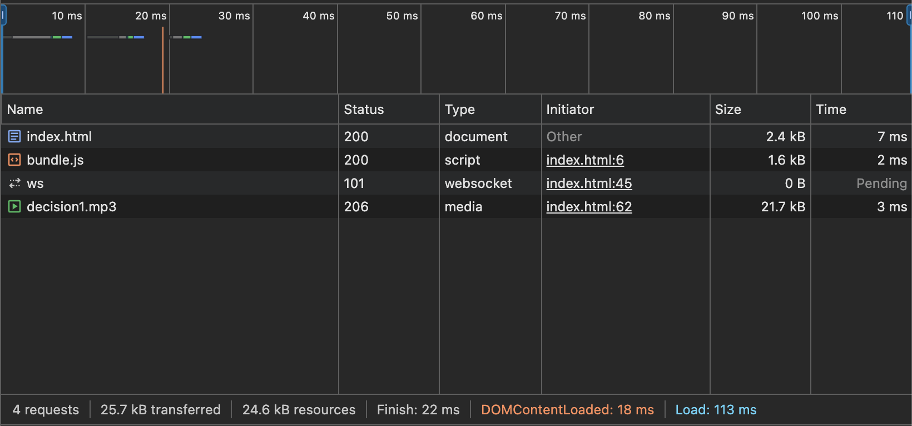
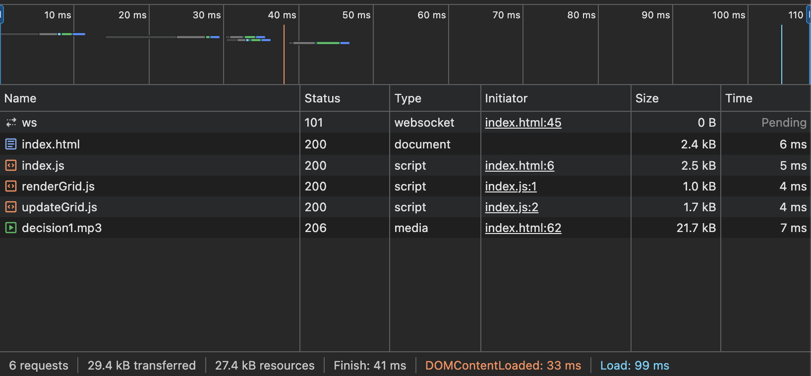

> バンドルしたコードと元のコードを比較し、どのような処理が行われたかを確認しなさい。

mode=productionでバンドルした場合とバンドルする前のコードを比較する。 
全ての処理が１行の１関数に集約される。変数は短縮表現に置き換えられる。

> バンドル前後それぞれのコードを利用するページをローカルサーバで配信してブラウザから閲覧できるようにしなさい。  
開発者ツールで `ネットワーク` タブを開き、スクリプトのダウンロード時間、ページの読み込み完了時間について比較しなさい。

- バンドル後のネットワーク速度
  - スクリプトのダウンロード時間：2msec
  - ページの読み込み完了時間：113msec

- バンドル前のネットワーク速度
  - スクリプトのダウンロード時間：13msec
  - ページの読み込み完了時間：99msec
