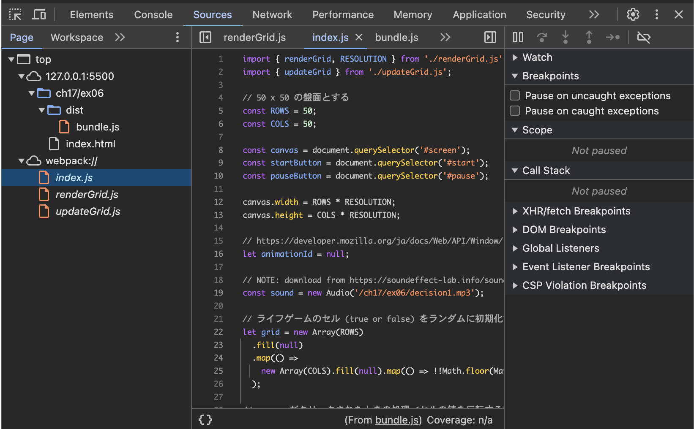
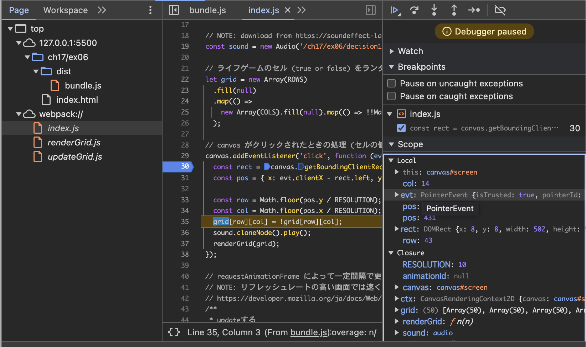

> 開発者ツールで `ソース` タブ(Chrome, Edge, Safari) または `デバッガー` タブ(Firefox) を開き、ソースコードファイルがどのように表示されるかを確認しなさい。

dist/bundle.jsはバンドルされた１つの関数のままだが、webpack://に元の実装内容が表示される。

> バンドルしたコードの実行中に、バンドル前のソースコードファイルに基づいたブレークポイントの設定や変数の値の確認等のデバッグが可能か確認しなさい。

バンドル前のソースコードファイルに基づいたブレークポイントの設定や変数値の確認は可能。

